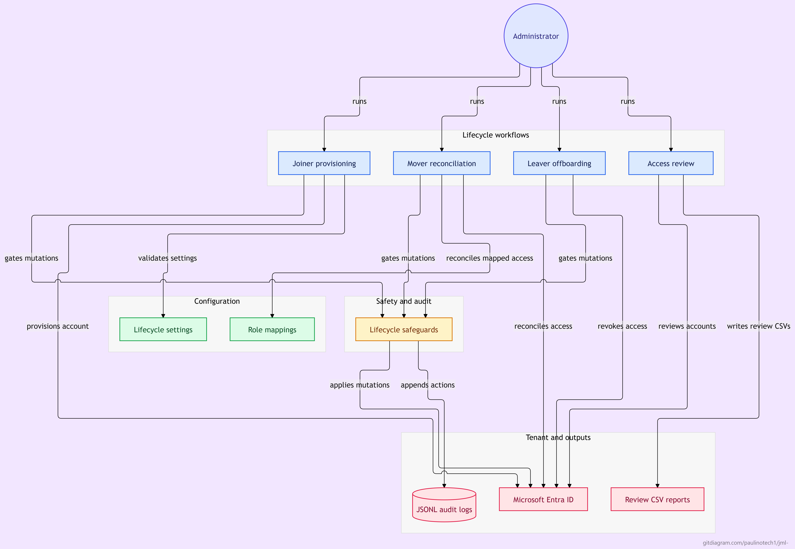

# Identity Lifecycle Automation (Joiner / Mover / Leaver)

PowerShell automation for employee identity lifecycle management in Microsoft Entra ID, built for small businesses: disciplined joiner/mover/leaver automation for the shop where IT is one person wearing five hats. Sized for tenants up to 1,000 users; it fails closed above that instead of pretending to scale.

## What this is

Four scripts that cover the full employee lifecycle:

| Script | Purpose | Mutates? |
|---|---|---|
| `src/Joiner-NewEmployee.ps1` | Provisions account, groups, licenses, manager | Yes (gated) |
| `src/Mover-UpdateEmployee.ps1` | Reconciles access after department/role change | Yes (gated) |
| `src/Leaver-OffboardEmployee.ps1` | Revokes sessions, disables account, strips access and licenses | Yes (gated, typed confirmation; `-Force` requires `-ChangeTicket`) |
| `src/Review-AccessReview.ps1` | Quarterly access review: stale accounts, privileged roles, guests, license waste | **No, read-only** |

Plus a shared module (`src/modules/IdentityLifecycle.Common.psm1`) that enforces the safety model in one place, offline Pester tests for pure logic and stubbed workflows, and runbooks.

## Architecture

An administrator runs one of four lifecycle workflows. Joiner, mover, and leaver validate their settings against `config/` and gate every mutation through the safeguards; the safeguards append each planned, executed, skipped, and failed action to the JSONL audit trail and execute mutations only with explicit `-Apply`. Ticket presence/format checks do not independently establish approval. The read-only access review writes its CSV reports under `reports/`.



## Safety model

This repo treats identity automation as a loaded tool. Three guardrails are structural, not advisory:

1. **Dry-run is the default.** Every script plans first. Without `-Apply`, all mutations are logged as `Planned` and nothing in Entra ID is touched. Run without `-Apply`, read the audit log, then run with `-Apply`.
2. **Single choke point.** Every mutation funnels through `Invoke-LifecycleStep` in the common module. There is no code path that writes to Entra ID without going through the dry-run gate.
3. **JSONL audit trail.** Every planned, executed, skipped, and failed action is appended to a timestamped audit log under `logs/`. The log records *that* a password was set, never the password itself.

Additional rules:
- The **leaver** requires typed confirmation (`DISABLE user@domain`) even with `-Apply`. `-Force` skips the prompt for scheduled runs but **requires** `-ChangeTicket` with the approved change record reference, which is written to the audit log. `-Force` without a ticket fails closed.
- The **mover** only removes memberships inside the *managed universe* (groups referenced by your role mappings). Manually assigned access outside lifecycle management is never touched.
- Groups are referenced by **immutable object ID**, never display name. A rename or duplicate display name cannot redirect membership changes; a config name that drifts from the tenant's display name produces a warning.
- Config validation **fails closed**: unknown departments, missing fields, legacy display-name group entries, and missing files throw before anything runs.
- Tenant-size guard: the access review **fails closed** above `maxTenantUsers` (default 1,000) rather than returning incomplete results from unpaged Graph queries.
- Secrets come from environment variables or certificates. Never from files in this repo. Certificate auth is strongly preferred over client secrets.
- The configured tenant GUID is passed to authentication and checked against the environment and authenticated context. Missing or conflicting tenant identity fails closed.
- Role mappings require explicit group/license arrays; omitted or null policy is never interpreted as intentional empty access.
- Live mover/leaver runs for the same tenant/user exclude one another on the same host. This does not coordinate separate hosts or external Graph clients.

See [Security corrections and rationale](docs/SECURITY_FIXES.md) for the review findings, migration steps, regression coverage, and exact limits.

## Quickstart

```powershell
# 1. Install the Graph modules you need
Install-Module Microsoft.Graph -Scope CurrentUser

# 2. Copy the example configs and fill in YOUR values (never commit the real ones)
Copy-Item config/lifecycle-config.json.example config/lifecycle-config.json
Copy-Item config/role-mappings.json.example config/role-mappings.json

# 3. Dry-run a joiner against your tenant (interactive sign-in, testing only)
./src/Joiner-NewEmployee.ps1 -FirstName Ada -LastName Lovelace `
    -Department IT -JobTitle 'Sysadmin' -ManagerUPN 'boss@contoso.com' -Interactive

# 4. Review logs/lifecycle-*.jsonl, then run for real
./src/Joiner-NewEmployee.ps1 -FirstName Ada -LastName Lovelace `
    -Department IT -JobTitle 'Sysadmin' -ManagerUPN 'boss@contoso.com' -Interactive -Apply
```

For automation, register an app and use environment variables instead of `-Interactive`:

```powershell
$env:LIFECYCLE_TENANT_ID     = 'your-tenant-id'
$env:LIFECYCLE_CLIENT_ID     = 'your-app-id'
$env:LIFECYCLE_CLIENT_SECRET = 'your-secret'   # or use a certificate: LIFECYCLE_CERT_THUMBPRINT
```

See `docs/APP_REGISTRATION.md` for the least-privilege permission set each script needs.

## Repo layout

```
config/        Example configs (copy to real names, never commit real values)
docs/          App registration, operational runbook
src/           Scripts + shared module
src/modules/   IdentityLifecycle.Common.psm1 (dry-run gate, audit, Graph auth)
tests/         Pester tests for logic that needs no tenant
logs/          Audit logs (gitignored)
reports/       Access review CSVs (gitignored)
```

## Why this exists

In a small IT shop, offboarding is where access goes to die quietly: ex-employees keep licenses, keep group memberships, keep sessions alive for weeks because nobody runs the full checklist. This repo makes the checklist executable, auditable, and safe to hand to the next admin. It is the operational counterpart to network segmentation and email hardening: boring, verifiable, and exactly what a mature org expects you to already know how to do.
